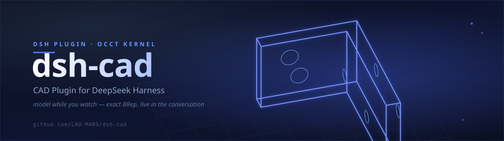
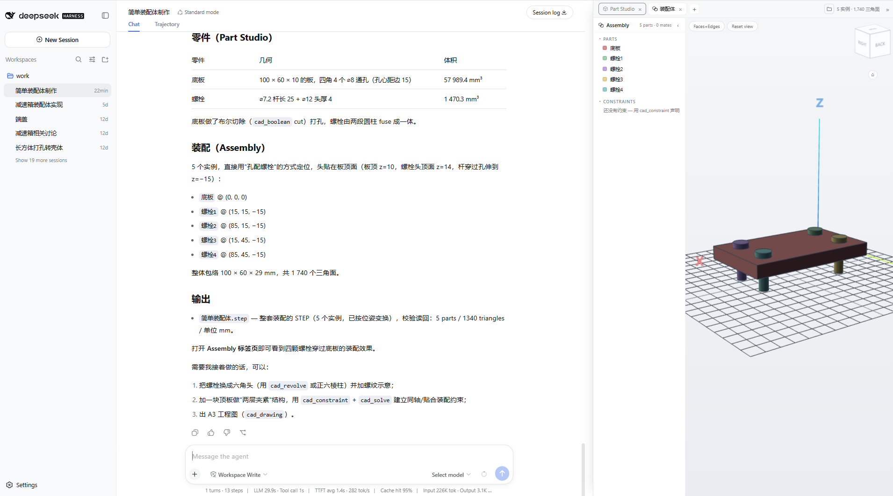

# dsh-cad — CAD Plugin for DeepSeek Harness



[](https://lau-mars.github.io/dsh-cad/)
[](https://www.npmjs.com/package/dsh-cad)
[](https://github.com/deepseek-ai/deepseek-harness)
[](https://nodejs.org/)
[](https://github.com/donalffons/opencascade.js)
[](./LICENSE)

English | [简体中文](./README.zh-CN.md)

A CAD plugin for [DeepSeek Harness (dsh)](https://github.com/deepseek-ai/deepseek-harness):
an **embedded 3D/2D CAD viewer** plus a **native parametric modeling tool family**
(OCCT kernel) in the Web UI, letting the agent build and inspect CAD geometry
step by step — "model while you watch".

## Preview

A full modeling session, end to end: the agent builds a parametric assembly
from plain chat — a 120×80×8 base plate with R5 rounded corners, then four
bolt instances placed at the corners — while the resident CAD panel tracks
every step live (parts tree with per-instance colors, ViewCube, "装配体"
assembly tab, 5 instances · 1,740 triangles). The finished assembly exports
as a structured STEP document and the agent verifies it by reading the file
back — 2 solids, 3 products, 2 assembly usages, 1,125.00 mm³:



## Feature Overview

| Capability | Description |
| --- | --- |
| ⚙️ Single-kernel architecture | **occt.ts as the primary modeling kernel** (true B-splines, native shell/draft, centroid); opencascade.js stays only as the fallback backend; the v0.8 "no editing after shell" seam is gone — fillet/chamfer/boolean keep working after shelling |
| 🔍 CAD viewing | STL / OBJ / STEP / IGES / BREP / DCPRT (3D), DXF / SVG (2D); interactive in-chat card (orbit / zoom / wireframe / pan) |
| 🧭 CAD editor interactions | Onshape-style ViewCube (26-zone click-to-orient), hover/click face & edge picking with live measurement (area mm² / length mm), Faces+Edges / Faces / Wireframe render modes, switchable BRep demo parts (bracket / flange / shaft) |
| 🏗️ Parametric modeling | Primitives, profile extrusion, **loft**, **sweep**, **revolve**, booleans, all-edge fillet/chamfer, **shell**, **draft**, **patterns** (linear/circular), transforms; profiles take **curve segments** (arcs/circles exact BRep; B-splines sampled approximation) — exact OCCT BRep, not a mesh approximation |
| 🗂️ Codex-style document tabs | The resident display panel gets a tab strip with a "+" menu: **Part** (Part Studio, the default) / **Assembly** (instance insert/move/remove) / **Drawing** (true hidden-line sheets); tabs are closable and keep their state |
| 📁 Multi-document file space | Named documents per workspace (`.dsh-cad/docs/`), each session bound to its own active document — new sessions start empty instead of inheriting leftovers; a folder button in the panel lists every document (preview / delete), and `cad_doc_new` / `cad_doc_open` manage the modeling target from chat |
| 📐 Engineering drawings | GB first-angle layout: front / top / left views + isometric, true OCCT hidden-line removal via the **occt.ts** kernel (an npm dependency, dashed); sheet frame, title block, overall dimensions, standard scale series; exports SVG / DXF |
| 🔗 Constraint solving & motion | **Ansatz** geometric constraint solver (**one command: `npm install ansatz-wasm`** — a wasm dependency, no Rust toolchain, no native binary): entity/constraint modeling (assembly instances ↔ rigid3 poses mapped automatically), solve-with-writeback, full DOF/residual/redundancy/suggestion diagnostics (LLM-oriented), and parametric kinematic sweeps (`cad_constraint` / `cad_solve` / `cad_motion`) |
| 📐 Geometry measurement | Exact volume (mm³), bounding box, triangle counts, DXF layers |
| 📤 On-demand export | STEP (parametric) / STL (mesh); files are written only when the user asks |
| 🖥️ Resident CAD panel | A permanent panel right of the conversation: Codex-style tabs (Part / Assembly / Drawing), tracking the latest model in real time while modeling |
| ⚡ Zero-copy render pipeline | worker mesh → in-memory binary → three.js typed arrays; zero base64 / zero intermediate files / zero per-step disk writes |
| 💾 Modeling document persistence | Operation log (JSON) + debounced disk mirror; automatically replayed to restore state after a process restart |
| 🖼️ Image → profile | PNG sketch/screenshot → Otsu binarization → contour tracing → extrusion-ready polygon (`cad_image_profile`) |
| 🔌 FreeCAD executor | Run the same op family on an external FreeCAD console (STEP in/out); requires a local FreeCAD install |
| ☁️ Onshape executor | Run the same op family on **Onshape** over its signed REST API — zero local install; every op compiles to a **standard Onshape feature** pushed into the target Part Studio (no Feature Studio setup). Readback is three-tier: cheap per-part STL by default, `readback: "step"` for exact-BRep-derived named meshes via a server-side STEP translation, or `readback: "none"` — build only and return the document link (~3 calls, quota-friendliest). Exports `.stl` / `.step` / `.x_t` (Parasolid). Quota-aware errors distinguish credential problems from free-plan cooldowns; the Onshape document URL is always surfaced |

## Installation

The plugin is published to npm — one line:

```sh
dsh plugin --profile web add dsh-cad
```

The installer applies the bundled `cordis.patch.yml` (declared in the `dsh.bundle` manifest) automatically, so there is nothing to configure by hand.

### Version requirements

- **Node.js** ≥ 22
- **dsh CLI** (`@deepseek-ai/dsh`): this plugin is developed against **0.1.0-rc.7**
  (minimum supported version, declared in the `engines` field of `package.json`);
  recommended **≥ 0.1.1-rc.2** (verified 2026-08-31)

### Install from source (dev mode)

```sh
git clone https://github.com/LAU-MARS/dsh-cad.git
cd dsh-cad
npm install && npm run build && npm test   # deps include occt.ts (true-HLR drawing kernel, ~20MB wasm)

npm install -g @deepseek-ai/dsh@^0.1.1-rc.2 pnpm   # requires Node ≥ 22
dsh web                                  # let the first launch init the profile, then Ctrl-C

dsh plugin --profile web add /path/to/dsh-cad

dsh web
```

The patch insert ships as `cordis.patch.yml` in the package root and is applied by the installer via the same `dsh.bundle` manifest.

Set `DEEPSEEK_API_KEY` and you are ready — for example:

- “open bracket.stl” → `cad_view`
- “model a 100×60×5 plate, punch a ⌀20 hole in the middle, R2 fillets on the four
  corners, add a ⌀16 boss 20 tall, export plate.step”
  → `cad_create_prim` + `cad_boolean` + `cad_fillet` + `cad_export`, with the 3D tab
  updating live at every step
- “build a snowman” → spheres + a cone nose + a cylinder hat (precise `at`/`axis` placement)
- “add two more b1, one rotated 90 degrees” → `cad_assembly_insert` + `cad_assembly_move`, the Assembly tab updates live
- “make an A3 drawing of b1 and export dxf” → `cad_drawing` (three views + iso + dashed hidden lines + dimensions) → `cad_export` `.dxf`

## Modeling Tool Family

| Tool | Description |
| --- | --- |
| `cad_view` | Open a CAD file and render an interactive viewer card |
| `cad_info` | Read-only geometry metadata (format / counts / bounding box / units / layers) |
| `cad_create_prim` | Primitives (mm, Z-up); `at` for placement, `axis` for orientation (exact axis-angle rotation) |
| `cad_extrude_profile` | Extrude a closed XY-plane polygon along +Z into a solid |
| `cad_loft` | Loft: skin a solid through successive closed sections (each a [x,y,z,…] loop in its own plane); sections may differ in shape and point count; `ruled` for straight sides |
| `cad_revolve` | Solid of revolution: revolve a closed profile around an axis (profile coords = (radius, height); curve segments supported — rounded rims exact); optional `angle` |
| `cad_chamfer` | Chamfer: bevel every sharp edge with one equal distance (mm) |
| `cad_pattern` | Pattern: linear (`delta` spacing) or circular (principal axis + `at` point + sweep angle); creates copy bodies, fuse afterwards for one body |
| `cad_shell` | Shell: hollow to a wall thickness (inward, outer skin preserved); `open` lists outward normals of the faces to open (empty = sealed). Runs on the occt.ts kernel; the result is a HOSTED body |
| `cad_draft` | Draft: tilt the walls `angle` degrees about a neutral plane (mold release); `direction` is the pull direction, walls auto-selected by default. Runs on the occt.ts kernel; the result is a HOSTED body |
| `cad_sweep` | Sweep: pipe a closed 2D profile along a 3D [x,y,z,…] path; the profile is auto-placed on the start plane, so no manual orientation |
| `cad_boolean` | fuse / cut / common (classic hole punching: plate cut cylinder) |
| `cad_fillet` | Constant-radius fillet on all sharp edges |
| `cad_transform` | Translate / Euler rotate / mirror |
| `cad_volume` | Exact BRep volume (mm³) |
| `cad_drawing` | Engineering drawing: front/top/left + isometric views, dashed hidden lines, frame, title block, overall dimensions, standard scale, A4/A3 |
| `cad_assembly_insert` | Insert a body into the assembly as a placed instance (`at` position, `rotate` orientation) |
| `cad_assembly_move` | Set an instance's absolute placement |
| `cad_assembly_remove` | Remove an instance from the assembly (the body stays) |
| `cad_constraint` | Declare the constraint model: entities (assembly-instance bindings) + constraints (distance/angle/mate/coaxial…), persisted in the op log |
| `cad_solve` | Solve with Ansatz and write poses back; returns DOF/residual/redundancy/suggestion diagnostics |
| `cad_motion` | Kinematic sweep: drive one constraint value from `from` to `to`, solve frame by frame, apply the last pose, return the motion table |
| `cad_export` | Export STEP / STL / DCPRT (the native replayable part document) to a workspace path; `target: "assembly"` writes the assembly STEP, `target: "drawing"` writes the sheet as SVG / DXF |
| `cad_delete` | Delete a body |
| `cad_docs` | List the workspace's modeling documents (id / name / bodies / updated, active marked) |
| `cad_doc_new` | Create a named document and make it the session's modeling target (start multi-part projects here) |
| `cad_doc_open` | Open an existing document (by id or name) as the session's modeling target — bodies replay exactly |
| `cad_doc_rename` | Rename a document |
| `cad_doc_delete` | Permanently delete a document (requires `confirm: true`) |
| `cad_freecad` | Run an op program on an external FreeCAD executor (optional STEP input / export) |
| `cad_fusion` | Run an op program on an external Fusion 360 executor (GUI bridge; optional export) |
| `cad_onshape` | Run an op program on the Onshape cloud (signed REST API): creates or drives a document, returns its URL; `readback: "step"` for exact BRep meshes; exports `.stl` / `.step` / `.x_t` (Parasolid) |
| `cad_image_profile` | PNG → contours → extrusion-ready polygon points |

After every modeling step: **the same viewer card refreshes in place** (stable viewId +
versioned URL), and the "3D" tab tracks the latest model in real time.

## Connectors (roadmap)

Modeling primarily runs on the **occt.ts kernel** (opencascade.js as the fallback backend) (OCCT in the browser —
zero install). The connectors below refer to **external CAD engines** acting as
executors for the same tool family, planned for future support:

| Connector | Suite | Platform | Status |
| --- | --- | --- | --- |
| **Built-in kernel** | CAD modeling kernel based on OCCT + WebGL, runs in the browser — zero install | All platforms (WebGL rendering) | ✅ Built-in |
| FreeCAD | open-source parametric suite — natural local executor via its Python API (console + GUI window modes) | Windows / macOS / Linux | ✅ Available (needs local install) |
| Fusion 360 | Autodesk CAD/CAM — resident add-in + spool bridge (no headless; the Fusion window doubles as a viewer) | Windows / macOS | 🧪 Experimental (`cad_fusion`) |
| SolidWorks | Dassault Systèmes industry-standard 3D CAD, COM/.NET automation | Windows only | 🚧 Windows demo scaffold (`scripts/solidworks-bridge/`) |
| Onshape | PTC cloud-native SaaS CAD, fully in the browser — signed REST API (cad.onshape.com or chamber hosts); every op compiles to a standard Onshape feature pushed into the Part Studio, results read back as per-part STL + mass properties, the cloud is the viewer | All platforms (browser) | ✅ Available (`cad_onshape`; set `DSH_ONSHAPE_ACCESS_KEY` / `DSH_ONSHAPE_SECRET_KEY`) |
| ZW3D（中望3D） | ZWSOFT all-in-one CAD/CAM | Windows / Linux | 🚧 Planned |
| GstarCAD 3D（浩辰3D） | Gstarsoft 3D CAD | Windows | 🚧 Planned |

All external engines implement the same **GeometryExecutor contract** (`available()` /
`run(opProgram) → meshes`), so the WebGL display layer never changes — swapping a
backend changes only the quality of the produced geometry.

## Architecture

```
cad_view(path)                        modeling tools (cad_create_prim, …)
  → import worker (occt-import-js)      → modeling worker (opencascade.js WASM)
  → CadScene JSON (base64-f32)          → exact BRep geometry + meshing
  → GET /dsh-cad/scene/<id>            → in-memory binary scene (f32/u32 packed)
                                        → GET /dsh-cad/bin/<docId>
            ↓ session presentationMeta (viewId + versioned URL) ↓
        browser card + persistent "3D" tab (three.js / SVG, Z-up, XYZ axes)
```

- **Two workers**: import (occt-import-js, read-only STEP/IGES/BREP) and modeling
  (opencascade.js 1.1.1, full OCCT) are separate, both lazily started; the `_N`
  suffix convention of embind overloaded constructors is wrapped in
  `src/modeling/occt-adapter.cjs` (all verified at runtime)
- **Zero-copy pipeline**: modeling scenes use zero base64 / zero large JSON arrays /
  zero per-step disk writes (disk mirror debounced 1.5s, replayed only on service
  restart); `cad_export` is the only explicit file export
- **Modeling document**: `<workspace>/.dsh-cad/model.json` operation log; all bodies
  are restored by replay after a restart
- **Drawing HLR kernel**: hidden lines run on **occt.ts** (npm dependency,
  `npm i occt.ts`) — true OCCT removal, no fallback engine, a missing kernel is
  a hard error. New APIs over opencascade.js: `hiddenLines()` true hidden-line
  removal, byte-level STEP/BRep `readStep`/`readBrep`/`writeStep`/`writeBrep`
  without MEMFS, tessellation with built-in feature-edge extraction, and a
  `hasError()`/`lastError()` error contract. Geometry crosses kernels as STEP
  bytes and the projected segments are remapped into the sheet frame. Kernel
  dist resolution: `DSH_OCCTJS_DIST` env var → `node_modules/occt.ts/dist`
  (npm, default) → `<repo>/../opencascade-ts/dist` (sibling checkout) → `vendor/`
  → `node_modules/opencascade-ts`
- **Constraint solving (Ansatz)**: the solver is the npm dependency
  **`ansatz-wasm`** (a wasm-bindgen build, single package ~538KB, zero deps) —
  installing dsh-cad pulls it automatically, and `npm install ansatz-wasm` alone
  upgrades it. **No Rust toolchain, no native binary, platform independent.**
  Resolution: the npm package (node_modules) → a `DSH_ANSATZ_WASM` directory → a
  sibling Ansatz checkout's pkg-node. The solver speaks one JSON envelope
  contract, with tool-layer errors (e.g. `unsupported_constraint`) surfaced
  verbatim for the LLM. Assembly placements (translate + XYZ Euler
  degrees) map bidirectionally to the solver's rigid3 poses (translate +
  exponential-map rotation, radians). Solver capability is staged
  (point-distance-to-origin today) — the plumbing contract is finished and needs
  no changes as it grows
- **Single-kernel architecture (v0.9)**: the primary modeling kernel is now
  **occt.ts >= 0.5.0** — primitives, curve-segment profiles (TRUE B-spline
  interpolation), loft/sweep/revolve, booleans, fillet/chamfer, shell/draft,
  mirror (composed as scale(-1) + a π rotation) and centroid all live in one
  session; engineering-drawing HLR takes the shape directly (zero STEP hops);
  editing after shelling is seamless (the v0.8 hosted-body seam is deleted).
  opencascade.js remains as the FALLBACK backend (auto-selected when occt.ts
  cannot load). Assembly STEP export writes a **structured document** (occt.ts
  ≥ 0.7.0 `writeStepDocument`): one root product plus one named, placed child
  per instance — instance separation survives the file (STL stays a single
  fused mesh; the fallback backend also fuses). Instance separation stays in
  the assembly scene/document for the fuse paths.
  Face selection matches `describe()` plane normals (outermost along ±normal)
- **Client**: esbuild single-file CJS factory (three.js inlined ~560KB, react provided
  by the host module table), Z-up CAD convention, empty scene with XYZ axis labels
  and a ground grid always displayed

## Tests

```sh
npm test                             # 41 tests: converters / modeling worker (exact volume assertions) / DCPRT round-trip / FreeCAD executor / image profiles / binary pipeline
node test/m0-kernel-check.cjs        # OCCT kernel API smoke test
node test/route-check.mjs            # JSON scene routing layer
node test/visual/serve.mjs           # browser card/tab visual verification page (http://127.0.0.1:3987)
```

Representative assertions covered: the boolean-punched volume exactly equals the
analytic value (28429.20 mm³), L-shaped profile extrusion 3000 mm³, volumes and
bounding-box flips of sphere/cone/torus placed with `at`/`axis`, 8-byte alignment
of the binary packing, an STL export round-trip (export → read back by the
phase-1 parser), and a DCPRT document round-trip (serialize → replay on the
OCCT worker → exact bounds).

## Known Limitations

- DWG (closed-source) is unsupported; DXF bulge arcs are approximated by chords;
  glTF/3MF viewing is not implemented (the structure is reserved)
- `cad_fillet` is all-edge constant-radius (per-edge selection is unstable under
  embind); chamfer is not implemented
- Sketch extrusion supports polygon profiles only (arc profiles are constructed by
  boolean combinations of cylinders/tori)
- dsh framework limitation: an already-mounted single slot (the right-side details
  panel itself) does not respond to components registered later, so the persistent
  view is provided as the "3D" view tab (a list slot, the official composition)
- The host reads CAD files via node:fs (the platform fs service supports UTF-8 text
  only and cannot carry binary data)

## Community

| QQ Group (🇨🇳 China) | Feishu (🇨🇳 China) | X / Twitter (🌍 International) | Discord (🌍 International) |
| --- | --- | --- | --- |
| `485038246` (join note: dsh-cad) | 🚧 Coming soon | 🚧 Coming soon | 🚧 Coming soon |

<!-- TODO: fill in the X handle / Discord invite link before publishing -->

## Contributors

Auto-generated from the commit history — thanks to everyone who has contributed!

[](https://github.com/LAU-MARS/dsh-cad/graphs/contributors)

## License

MIT
